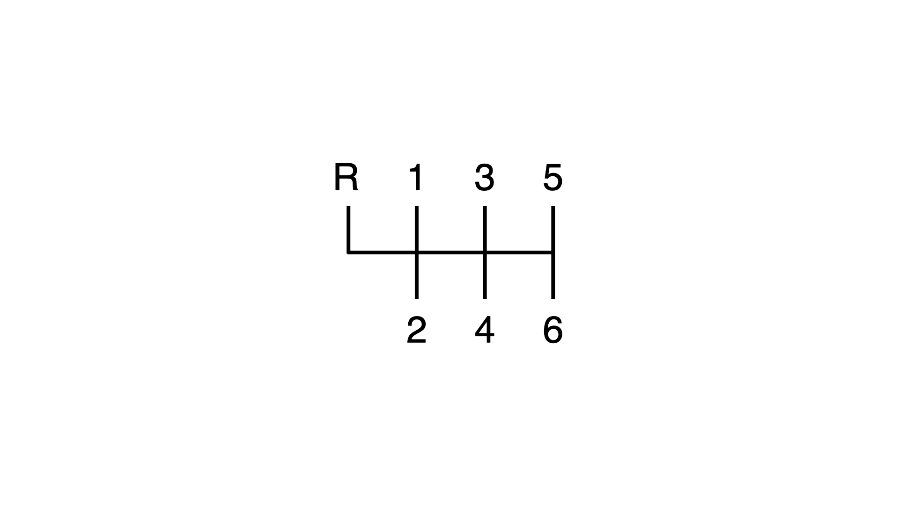

# 写给前端的手动内存管理基础入门（一）返璞归真：从引用类型到裸指针



作为一名经常需要在团队中搞跨界合作的前端开发者，我发现许多往往被人们敬而远之的「底层」技能其实并不必学到精通才能应用。只要能以问题导向按需学习，就足以有效地完成工作，取得成果了。像 C、C++ 和 Rust 中的手动内存管理，就是这样的例子。我们完全可以绕开语言的黑魔法，只学习它们对工程而言最必要的特性与最佳实践。这就足够我们开发出它们与 JS 交互时的原生扩展，或调用平台库实现功能了。

因此，本系列文章将以实用和入门角度出发，专注于解释这几门「原生语言」中，与手动内存管理相关的子集。整个主题（暂定）依次包括这些部分：

* **返璞归真：从引用类型到裸指针**——在 GC 的庇护下，我们对 JS 中引用类型（如对象）占用的内存可以放心地一无所知。那么如果想自己手动管理一段内存空间，这时最朴素最简单最经典的做法，是怎样的呢？令许多计算机专业新生「闻风丧胆」的指针，理解起来真的比 JS 困难很多吗？
* **新瓶旧酒：面向对象的资源管理**——原始的 C 语言是面向过程的，并不易于维护。在智能指针到来前，C++ 已为此投入了大量工作。我们是否能借此以更为声明式的代码和思想来管理资源呢？这时最常见的坑又是什么样的呢？
* **半自动化：引用计数与智能指针**——无 GC 的内存管理只能完全手动吗？是时候接触现代 C++ 中的智能指针了。理想情况下只要利用好这套基础设施来写 C++，其开发效率未必会差 JS 太多（当然理想和现实是有差距的）。
* **触类旁通：进入 Rust 时代**——最后，很多人在光有 JS 背景去硬啃 Rust 时，可能会遇到不少显得奇怪的语言特性。但有了上面的铺垫后，你或许就可以「秒懂」Rust 为什么要这么设计了。你会看到只要理解了原理，要把内存管理的经验在 C++ 和 Rust 之间复用，其实并非难事。

由于在内存管理方面，JS 和其他常见的 Java、Python 和 Dart 等带 GC 语言的差别并不大。因此熟悉这些语言的同学，也可以很容易地按这篇文章介绍的方式，由浅入深地掌握这项工程技能。另外在前端开发者们常用的 macOS 上，C/C++ 的编译环境更完全是现成的，没有任何折腾的必要。本文中的代码都是无需第三方依赖的单线程简单示例，因此也不必接触复杂的构建配置和多线程心智模型。

作为系列的起点，下面我们将从 JS 返回 C 的世界。有位做 C++ 的朋友提醒我说「*裸指针可能是最难的*」。但其实个人认为对现在**普遍熟悉强类型语言**的前端开发者们来说，裸指针反倒很容易通过一些技巧来快速类比掌握。不过鉴于指针的新人杀手性质，本文会尝试提供一条尽可能平滑的学习曲线。相信只要过了这一关，大家读起后面的内容会轻松顺利很多。

本篇介绍可分为如下几个部分：

* 你可能已经掌握的 C 子集
* 熟悉指针类型
* 为指针分配内存
* 指针、数组与字符串
* 指针与 C++ 中的引用

下面，让我们首先从每位前端开发者都耳熟能详的「基础类型」和「引用类型」说起吧。

## 你可能已经掌握的 C 子集
当我们探讨「原生」语言中的内存管理时，C 语言是我们很难绕开的话题。它的影响极为深远，以至于很多时候当你熟练地使用其他高级语言编码时，你甚至未必知道自己可能已经（部分地）学会了 C。比如，如果只考虑 `double` 和 `int` 这样的基础类型，那么你会发现这时的 C 语言，几乎不可思议地接近 JS 和 Dart。像下面这段用来计算斐波那契数列的经典代码，就同时既是有效的 C，又是有效的 Dart：

``` c
int fib(int n) {
  if (n <= 0) return 0;
  else if (n == 1) return 1;
  else return fib(n - 1) + fib(n - 2);
}
```

上面这个例子中，在发生形如 `fib(n - 1)` 的函数调用时，调用方 `n - 1` 表达式的值会被复制一份，传给被调用的函数，这也就是所谓 [pass by value](https://en.wikipedia.org/wiki/Evaluation_strategy#Call_by_value) 的经典心智模型了。对于整数和浮点数等「小」数据类型，这种设计从 C 时代起，一直在主流工业语言中沿用至今。所以如果你只用 JS 或 Dart 做这类纯粹的算术计算，那么你完全可以（自豪地）认为这时你写的代码就是 C 语言子集的一种方言变体，当然这个子集其实也没多少实用价值就是了。

> 有些语言会把类型定义放在变量标识符前面，如 C、C++、Java、C# 和 Dart。也有一些则会把类型放在标识符后面，如 TypeScript、Rust 和 Go。像 `int x` 还是 `x: int` 这种风格问题本身并没有多少好坏之分，大家只要入乡随俗地习惯就行。

根据小学二年级的前端知识，我们知道在 JS 中，整数和浮点数属于基本类型（[primitive values](https://262.ecma-international.org/11.0/#sec-primitive-value)），而对象则属于引用类型。所谓「引用」就像超链接一样，是个指向实际对象的标识符。在 JS 中，当我们把对象作为参数来执行函数调用时，引用会被复制一份传入被调用的函数，而引用所指向的对象本身则不会被拷贝——前端社区里解释这件事的文章早已汗牛充栋，这里就不再赘述了。关键的问题在于，在 C 语言里传递「对象」时又是怎样的呢？

有趣的是，**如果我们坚持写语法最简单的 C，那么你会发现这时的 C 甚至在心智模型上能比 JS 更加简单**，简单到你都可以不用考虑「引用」这个常常困扰初学者的概念。实际上，当我们在 C 语言中使用 `int a` 这样的语法来定义变量时，数据通常会被分配在栈（此处指原生程序的运行时调用栈，即所谓的 [The Stack](https://en.wikipedia.org/wiki/Call_stack)）上。这类变量的内存能做到被优雅地零开销自动管理，因为在离开函数作用域时，在栈上分配的内存都会被自动回收。而对于 C 语言中常用于模拟对象的 `struct` 结构体来说，默认你也能用这种方式来管理它的内存——**也就是完全不用你费心管**！没有内存泄漏，没有悬空指针，一切简单明了地自动完成。

让我们举例说明这种「最简单的 C」吧。假设我们想基于 Skia 这样的 2D 图形绘制库，实现自己的 UI 框架。那么这时框架中所建模的最重要的抽象概念，应该就是屏幕上的矩形图层（这里把它称为 Layer）了。基于朴素的 C 结构体语法，我们可以这么建模图层 Layer 的基础结构：

``` c
// 导入标准库中的 printf 函数
#include <stdio.h>

// 定义名为 Layer 的结构体，包含 x y w h 四个字段
struct Layer {
  double x;
  double y;
  double w;
  double h;
};

// 输出 layer 的宽高尺寸
void printSize(struct Layer layer) {
  // 使用 layer.xxx 语法来获取字段
  printf("width: %f, height: %f\n", layer.w, layer.h);
}

int main() {
  // 使用字面量语法建立栈上的 layer 实例
  struct Layer a = {0.0, 0.0, 100.0, 100.0};
  printSize(a);
}
```

不过 `struct Layer` 这样的类型名有些啰嗦，所以我们常常会用 `typedef` 语法来简化一下它，像这样：

``` c
// 把 struct Layer 定义为 Layer
typedef struct Layer {
  double x;
  double y;
  double w;
  double h;
} Layer;
```

这样一来，我们就可以用 `Layer` 这个类型来替代 `struct Layer` 了：

``` c
void printSize(Layer layer) {
  printf("width: %f, height: %f\n", layer.w, layer.h);
}

int main() {
  Layer a = {0.0, 0.0, 100.0, 100.0};
  printSize(a);
}
```

基于这种语法，你甚至可以在 C 语言中轻松地获得纯粹的，无副作用的的纯函数。它完全通过返回值来输出计算结果，从而彻底避开 JS 函数内部直接 mutate 外部对象的问题：

``` c
// 将某个 layer 的尺寸放大两倍
// 不同于 JS，这里传入的 layer 相当于原始值的拷贝
Layer doubleSize(Layer layer) {
  // 这里不会 mutate 原本的结构体数据
  layer.w *= 2.0;
  layer.h *= 2.0;
  return layer;
}

int main() {
  Layer a = {0.0, 0.0, 100.0, 100.0};
  // 如果只调用 doubleSize(a) 而不赋值，是不会修改 a 的
  a = doubleSize(a);
  printSize(a);
}
```

遗憾的是，上面这种手法虽然看起来简单易懂，但真实的 C 工程项目中经常不会这么做。为什么呢？首先，这种传值形式可能在函数调用之间产生较多冗余的拷贝，影响程序的性能。并且有些资源（例如 GPU 纹理）甚至未必位于内存中，它们更是不可随意拷贝的。这时该怎么办呢？

## 熟悉指针类型
终于，是时候让我们讨论 C 语言中的「引用类型」了——通过引入「**指针**」的概念，C 语言赋予了你自由地引用和解引用内存地址的能力。传统上，指针常常让新手感到艰深晦涩。而某些应试教育中人为制造的 `int ****p` 等脱离实际的问题，更加深了普通人对其的畏惧感。但下面我们将介绍一种简单的技巧，展示如何通过引入一点点写法上的改变，让你即便只有 JS 系语言的使用经验，也能轻松地写出可以通过编译的指针操作代码。

这条技巧说起来其实很容易，**那就是把指针当作一种特殊的变量类型即可**。你可以在任何类型的后面加一个 `*`，获得其相应的指针类型，像这样：

``` c
int x1; // 定义出 int 类型的变量 x1
int* x2; // 定义出 int* 类型的变量 x2
Layer layer1; // 定义出 Layer 类型的变量 layer1
Layer* layer2; // 定义出 Layer* 类型的变量 layer2
```

> 为了便于理解，本文把指针类型以外的类型统称为「普通类型」。对所谓「普通类型」更准确的定义其实是「值类型」。C 语言中的值类型既包含整数和布尔值这样的基础类型，也包括了 `struct` 和 `enum` 这样的复合类型，在 C++ 中还包括了 `class`。**总之如果不使用指针，那么 C 语言并不像 JS 那样「对象就是引用类型」**。更详细的相关定义可参见 [Wikipedia](https://en.wikipedia.org/wiki/Value_type_and_reference_type)。

上面这种写法，看起来（至少在个人眼里）很贴近前端在使用 TypeScript 等强类型语言时的思维模型。但要注意的是，它其实和「经典」的 C 编程风格是有所不同的。传统上，C 语言代码中习惯使用 `int *p` 的风格来定义指针变量。其理由很简单，如下所示：

``` c
int* p, q; // 这里的 q 是 int 类型，不是 int* 类型！
int *p, *q; // 改成这样就不会写错
```

不过，个人认为使用 `int* p` 的风格，更有助于我们将指针概念融入大家现在所习惯的类型系统，降低一些学习成本。例如在谷歌 Chromium 项目中，就使用了这样的编码风格。基于这种风格，不论是整数、浮点数还是结构体，如果它们默认的类型是 `Type t`，那么 `Type* t` 就是其相应的指针类型。不管在哪种情况下，你定义出的变量名始终是 `t` 而不是 `*t`。

按照这个「把指针当作一种变量类型」的理解方式，你会发现指针变量如果（十分鲁莽地）不考虑安全性问题，它们在使用时的心智负担实际上非常小。**具备指针类型的变量同样可以被重新赋值，也可以作为函数参数自由传递**。像这样：

``` c
// 这个函数接收 Type* 类型的变量，这在 C 中非常常见
void renderLayer(Layer* layer) {
  // ...
}

int main() {
  // Layer* 类型变量可以这样简单地定义出来
  Layer* a;
  // Layer* 类型变量也可以用函数来创建，先忽略这里的细节
  Layer* b = makeLayer(0.0, 0.0, 100.0, 100.0);
  // Layer* 类型变量之间可以自由地互相赋值
  a = b;
  // Layer* 类型变量也可以作为函数参数传递
  renderLayer(a);
}
```

看起来是不是也很简单呢？不过，指针类型和普通类型显然还是有所不同的。回到 Layer 的例子，`Layer*` 类型的指针变量在使用时相比于 `Layer` 类型的普通变量，其区别简单看来只有这么两条：

* 指针类型变量，在函数调用之间传递的是引用的拷贝。
* 指针类型变量，需要用形如 `obj->x` 的语法替代 `obj.x` 来存取值。

体现这两条区别的例子是这样的：

``` c
void doubleSize(Layer* layer) {
  // 通过指针变量，可以直接 mutate 原本的结构体数据
  layer->w *= 2.0;
  layer->h *= 2.0;
  printSize(layer);
}

int main() {
  // 先忽略创建 Layer* 类型变量时的细节
  Layer* a = makeLayer(0.0, 0.0, 100.0, 100.0);
  // 因为传递的是引用，这里不再需要函数返回值了
  doubleSize(a);
}
```

在这个例子中，通过引入指针，我们使用 C 的方式已经发生了变化，能以引用类型的心智模型来编写逻辑了。不过，指针变量和普通变量之间并不直接兼容。这也就是说，需要 `Layer*` 变量的地方不能传入 `Layer` 变量，反之亦然。所幸它们之间可以简单地进行双向转换，其语法是这样的：

* 通过 `&` 操作符，你可以把 `Layer` 类型转换成 `Layer*` 类型，亦即所谓的**引用**（reference）。
* 通过 `*` 操作符，你可以把 `Layer*` 类型转换为 `Layer` 类型，亦即所谓的**解引用**（dereference）。

所谓的引用和解引用，其实很类似 Vue 3.0 中的 `ref` 和 `unref`。这种转换的编写本身并不需要额外的条件，只要类型匹配就能通过编译。其相应的例子类似这样：

``` c
void printSize1(Layer layer) {
  printf("width: %f, height: %f\n", layer.w, layer.h);
}

void printSize2(Layer* layer) {
  printf("width: %f, height: %f\n", layer->w, layer->h);
}

int main() {
  Layer* a = makeLayer(0.0, 0.0, 100.0, 100.0);
  Layer b = {0.0, 0.0, 100.0, 100.0};
  printSize1(*a); // 将 Layer* 转为 Layer
  printSize2(&b); // 将 Layer 转为 Layer*
}
```

## 为指针分配内存
了解指针类型与普通类型之间的转换后，擅长活学活用的同学可能立刻就能想到，我们是不是可以像下面这样简单直接地实现 `makeLayer` 函数呢？

``` c
Layer* wronglyMakeLayer() {
  Layer layer = {0.0, 0.0, 100.0, 100.0};
  return &layer;
}
```

不幸的是，虽然这段代码能通过编译，但它却犯了个严重的错误。我们把函数内部局部变量所在的内存地址传了出去，而这份分配在栈上的内存空间，在函数返回后就会直接被回收！因此即便能通过编译并有时「凑巧」能正常工作，这段代码也是有问题的，会收到现代编译器的警告。

那么，到底该如何合法地创建出指针类型的复杂结构呢？这需要我们手动申请和销毁内存。C 函数自动管理的内存一般分配在栈上，而这类动态分配的内存则位于堆（[heap](https://en.wikipedia.org/wiki/Memory_management#HEAP)）上。让我们来看看这个过程涉及到哪些 API 吧。

我们知道，要在 C 和 C++ 中使用库，需要引入相应的 `.h` 头文件。像 `stdio.h` 就包含了 `printf` 函数。对于内存分配，我们可以使用标准库 `stdlib.h` 中的 `malloc` 函数。只要为它传入所需的内存大小，就可以获得一个指向这段空间的 `void*` 类型指针了。可以认为 `void` 相当于 TypeScript 中的 `any`，因此 `void*` 也就是能指向任意类型数据的指针。C 语言中的类型转换规则较为宽松，这个 `void*` 类型变量可以被直接赋值给任意的指针类型，并需要用 `free` 函数销毁。至于 `malloc` 所需的具体字节尺寸数字，则可以通过 `sizeof` 关键字在编译期计算出来。像这样：

``` c
#include <stdlib.h> // 导入用于手动管理内存的库函数

Layer* makeLayer(double x, double y, double w, double h) {
  // 分配 Layer 所需尺寸的内存空间
  Layer* layer = malloc(sizeof(Layer));
  layer->x = x;
  layer->y = y;
  layer->w = w;
  layer->h = h;
  return layer;
}

void test() {
  Layer* a = makeLayer(0.0, 0.0, 100.0, 100.0);
  // ...
  free(a); // 用完记得 free 掉
}
```

除了 `malloc` 以外，C 标准中还有能将分配到的空间清零的 `calloc` 函数，以及能就地调节原指针指向空间大小的 `realloc` 函数。它们返回的都是 `void*` 类型的指针，可以用 `free` 销毁。并且在 C 里，我们还可以通过 `TypeB* b = (TypeB*)a` 这样的强制类型转换语法，把指向某段内存空间的指针映射到任意类型。但不论如何转换类型，对于指向某段内存地址的指针，其在 `malloc`/`calloc`/`realloc` 时所分配的内存空间，都能正确地被 `free` 掉。对此有种简单易懂的理解，就是认为 `free` 既然接受的是 `void*` 类型，它到底要释放多少内存空间显然与特定类型无关。不过这背后更具体的原理，则在《Operating Systems: Three Easy Pieces》中有很精彩的论述，推荐感兴趣的同学阅读。

当然，如果觉得指针只要学会了 `malloc` 和 `free` 就能用好，那就太小看它了。C 中原始的裸指针机制，非常容易带来一些棘手的问题。前面我们说到过，所谓「引用」就像 URL 超链接一样，是个指向实际内容的标识符。而在没有 GC 当保姆的时候，这种标识符机制所产生的问题，和我们日常上网使用超链接时遇到的很像。比如这么几种：

* **使用了未初始化的指针**，即所谓野指针（wild pointer）——相当于链接生成后还没准备好内容就点开，于是页面一片空白。
* **使用了已经被释放的指针**，即所谓悬空指针（dangling pointer）——相当于原页面被删除但链接却留着，于是一点开链接就是 404。
* **内存泄漏**——相当于链接被遗忘了，于是某个页面虽然已经没有价值，却没有被及时删除掉。

如何感受指针的危险呢？在 JS 中，我们常用一个对象是否为 `null` 来判断它是否存在。这种「天经地义」的效果在 C 中是不成立的。虽然 C 中有 `NULL` 宏，但一旦出现悬空指针和野指针，它们都可以通过 `NULL` 检查！比如这样：

``` c
void renderLayer(Layer* layer) {
  // 常见的防御判断对悬空指针无效！
  if (layer == NULL) return;
  // ...
}

int main() {
  Layer* a = makeLayer(0.0, 0.0, 100.0, 100.0);
  free(a);
  // 这时的 a 不为 NULL，它是个悬空指针
  renderLayer(a);
}
```

如果把失效的地址拿来解引用，很容易导致程序的运行时崩溃。诸如此类的各种问题使得指针虽然容易通过编译，准确地用好它却很难——不过作为手动内存管理的元祖级特性，现在我们至少已经知道该怎么理解和编写它了。并且对前端开发者而言，就算还没有指针的实际工程经验，只要借助对其概念的理解，C 的许多重要语言特性一下就会显得很简单了。

## 指针、数组与字符串
在经典的谭书等 C 语言教材中，是先讲字符串和数组，再讲指针的。如果把 C 作为第一门编程入门语言，这个安排有其合理性。但本文并未遵循这条路线，**因为只要我们先从 JS 的引用类型出发理解了 C 的指针类型，很容易继续把 C 的数组当作一种指针来理解，进而理解字符串的结构**。

首先，指针是可以和整数之间做加减运算的——对具备「对象是引用类型，数字是基本类型」经验的前端同学来说，这恐怕有点毁三观。毕竟基于 JS 的思维模式，`obj + 1` 难道不应该是……`"[object Object]1"` 吗？但在 C 语言里，这是极为重要的指针运算。假设我们为某种类型的 N 个实例分配了一整段内存空间，而这段空间的起始位置又有个指针。那么我们就可以用这种方式，指向其中的某个实例：

``` c
// 在堆上分配足够容纳 5 个 Layer 的内存空间
Layer* p = calloc(5, sizeof(Layer));

// 可以直接解引用出第一个 Layer
Layer first = *p;

// 或获得指向第二个 Layer 的指针
Layer* secondA = p + 1;

// 也可以这样解引用出第二个 Layer
Layer secondB = *(p + 1);
```

但是，上面 `*(p + 1)` 这种写法实在太不语义化了。为此 C 设计了数组语法，可以给指针操作披上一层壳：

``` c
// 在栈上分配 5 个 Layer 实例
Layer a, b, c, d, e;
Layer layers[] = {a, b, c, d, e};

// 这比 *(p + 1) 直观多了吧
Layer second = layers[1];
```

可以看出，`*(ptr + offset)` 等价于 `ptr[offset]`，而这个 `offset` 每次 `+1` 时对应的字节数，正是 `ptr` 所指类型的 `sizeof` 大小。比如假设 `sizeof(Layer)` 的结果是 32，那么 `layers[2]` 就等价于偏移 `2 * 32` 个字节的内存地址——**这种简单明了的对应关系，其实也是 C 语言从零开始计算数组下标的原因之一**。除了 `[]` 以外，前面提到的 `->` 运算符也有这样的语法糖性质，`obj->x` 实际上就等价于 `(*obj).x`。

对于装载任意类型数据的 C 数组，你都可以创建出指向它的指针。如果数组的类型是 `Type[]`，那么相应指针的类型就是 `Type*`。并且，数组和指针都能用 `[]` 运算符来取下标。像这样：

``` c
// int[] 类型的数组
int arr[] = {0, 1, 2};
// int* 类型的指针，指向数组起始位置
int* p = arr;

// 下面这两行代码是等价的
int tmp1 = arr[1];
int tmp2 = p[1];
```

别忘了 `int` 和 `Layer` 都属于值类型，所以我们也能轻松照猫画虎地写出这样的代码：

``` c
Layer a, b, c;
// Layer[] 类型的数组
Layer layers[] = {a, b, c};
// Layer* 类型的指针，指向数组起始位置
Layer* p = layers;

// 下面这两行代码也是等价的
Layer tmp1 = layers[0];
Layer tmp2 = p[0];
```

更进一步地，数组里可不只能装普通类型，也能装指针类型：

``` c
Layer* a = malloc(sizeof(Layer));
Layer* b = malloc(sizeof(Layer));

// 数组中的每项都是 Layer* 类型
Layer* layers[] = {a, b};
// 等效的指针形式，指向数组起始位置
Layer** p = layers; 

Layer* first = layers[0]; // 等价于 p[0]
first == a; // true

// 记得销毁 malloc 出的对象
free(a);
free(b);
```

`Layer**` 这个类型可能有些费解，它的字面意义是 `Ptr<Ptr<Layer>>`，在实践中既可以兼容 `Ptr<Array<Layer>>`，也可以兼容 `Array<Ptr<Layer>>`，我们这里使用的是后者。**不要再纠结于传统 C 语言教程中所谓「数组指针」和「指针数组」这种含糊的概念了。直接从类型的角度理解它们，会准确而可靠得多**。

C 中的数组非常简单，它纯粹只是一段连续的内存空间，并不携带长度信息。在将数组作为函数参数传递时，一般还要单独将其长度作为参数传递。这时候它们对外的 API 形式也都很接近：

``` c
// 接收数组为参数的函数
void printArr(int arr[], int len) {
  arr[len - 1]; // 数组的最后一项
}

// 等价的指针形式，虽可用但语义化程度较差
void printPtr(int* arr, int len) {
  arr[len - 1]; // 数组的最后一项
}
```

为什么 `int arr[]` 好像总能转换成 `int* arr` 来使用呢？实际上在需要指针类型的地方，C 会将数组类型自动退化（decay）为指针类型。因此 `int[]` 和 `int*` 虽然类型不同，但需要 `int*` 的地方总可以传入 `int[]`。

既然 `int[]` 和 `int*` 的兼容性这么好，`char[]` 和 `char*` 自然也不例外——**然后我们就可以很容易地理解 C 中的「字符串」了**。C 中从来没有 `string` 类型，只有用来表示单个字节的 `char` 类型。于是，由一串 `char` 类型字符数据组成的数组，就构成了「真 · 字符串」。假设我们要为 Layer 增加 `name` 字段，就可以直接这么写：

``` c
typedef struct Layer {
  double x;
  double y;
  double w;
  double h;
  char name[50]; // 预留 50 字节的位置
} Layer;
```

或者把 `char[]` 换成不受长度限制的 `char*` 类型：

``` c
typedef struct Layer {
  // ...
  char* name;
} Layer;
```

这两种形式都可以这么初始化：

``` c
Layer a;
Layer b = {0.0, 0.0, 0.0, 0.0, "hello"};
```

但 `char[]` 有个地方需要注意，那就是它不能被重新赋值。比如这样：

``` c
#include <string.h>

typedef struct Layer {
  // ...
  char name[50];
} Layer;

int main() {
  Layer layer;
  layer.name = "world"; // 但这是无法通过编译的
  strcpy(layer.name, "world"); // 要换成这样
}
```

相比之下，`char*` 就没有这种限制：

``` c
typedef struct Layer {
  // ...
  char* name;
} Layer;

int main() {
  Layer layer;
  layer.name = "world"; // 这样可以通过编译
  strcpy(layer.name, "world"); // 这样也可以
}
```

除了赋值时的区别外，C 中的字符串也不能靠 `==` 来比较。`==` 只能用于比较指针和算术类型。如果直接比较两个 `char[]` 数组，这时虽然可以通过编译，但 C 会将数组退化为指针来进行比较，其结果并不是我们想要的。因此不管是 `char[]` 还是 `char*` 类型的字符串，其通用的比较方式都是使用 `string.h` 标准库中的 `strcmp` 函数。

> 另外，前面的结构体 `Layer` 类型也不能用 `==` 来比较，只有 `Layer*` 可以。不妨想想这是为什么，又该怎么办呢？

我们已经发现，字符串既可以是 `char[]` 类型，也可以是 `char*` 类型。这里存在一个容易混淆之处，亦即字符串的存储位置。像下面的三行代码虽然同属 `char` 家族，但它们运行时所处的内存区域却各不相同：

``` c
int main () {
  char a[] = "hello"; // 分配在栈上
  char* b = malloc(10); // 分配在堆上
  char* c = "world"; // 指针 c 在栈上，"world" 在常量区
}
```

上面的例子，反映出了 C 中字符串可能对应的几种内存分配位置：

* **栈上**：对于 `"hello"`这样赋值给 `char[]` 的字符串，它和 `int a[] = {1, 2, 3}` 一样，整个数组内的数据都是分配在栈上的。
* **堆上**：对于 `malloc` 动态分配出的字符串空间，自然分配在堆上。如果想动态改变这类字符串的长度，还可以通过 `realloc` 来实现。不妨将此留作习题（狗头）。
* **常量区上**：对于 `"world"` 这样直接赋值给 `char*` 的字符串字面量，一般在程序运行过程中始终位于固定的内存空间，因此不需要操心它的释放。但注意指针 `c` 本身也是个函数内的局部变量，因此它分配在栈上。`c` 本身可以通过栈的内存管理来自动销毁，但它指向的东西则不行——其他指针也是这么个道理。

在这里，我们可以再次感受到 C 的抽象层次之低。作为入门性质的文章，这里不会继续深入相关的 OS 和编译产物细节。不过至少目前来看，这个例子可以告诉我们，为什么有些地方传来的字符串需要手动销毁，有些则不需要了。

## 指针与 C++ 中的引用
上文已经覆盖了对指针常用知识的基本介绍。在传递引用方面，C 为我们提供的特性实质上也就只有它了。但对于「引用类型」这个概念，最后值得简单一提的还有 C++ 中的引用（reference）语言特性。

> C++ 中的引用和 C 的指针，都可以认为是（相对于值类型的）引用类型。本文中除非特别提及，所谓「引用类型」都指广义上的通用概念，而不是 C++ 中的这项具体语言特性。

经过上面的论述，我们已经知道对于 `Layer` 这个类型，存在着 `Layer*` 和 `Layer[]` 这两种引用类型了。C++ 中加入了一种新的类型，那就是 `Layer&`。像这样：

``` cpp
Layer a;
Layer& b = a;  // 创建一个 Layer& 类型变量
```

或许不少人只要一看到带着 `&` 和 `*` 的类型就头疼。不过这里有条好消息，那就是 `Layer&` 类型可以当做普通的 `Layer` 类型来用！像这样：

``` cpp
void printSize(Layer layer) {
  printf("width: %f, height: %f\n", layer.w, layer.h);
}

int main() {
  Layer a;
  Layer& b = a;

  // Layer 和 Layer& 的存取值语法一样
  a.w = 100.0;
  b.w = 200.0;
  
  // 作为参数传递时的用法也一样
  printSize(a);
  printSize(b);
}
```

这么看来，这种类型有什么存在的意义呢？它的名字已经告诉了我们答案，那就是「引用」能力了。如果我们写的是朴素的 `Layer b = a` 而非 `Layer& b = a`，那么这里的 `a` 和 `b` 是两个独立的实例，对 `b` 的修改不会影响 `a`。而对于 `Layer&` 类型的 `b` 来说，对它的修改也会直接影响到 `a`。这个差异应该很容易理解，这里就不展开赘述了。

C++ 引用特性的一种常见用途，是优化函数传参时的拷贝开销。刚才我们用来接收 `Layer` 的函数是这样的：

``` cpp
// 接收普通的值类型，会产生拷贝
void printSize(Layer layer) {
  // ...
}
```

每次调用这个函数时，传入的 Layer 数据都会被完整地拷贝一份。为此，我们可以把输入参数的类型从 `Layer` 换成 `Layer&`——由于 `Layer` 和 `Layer&` 之间的良好兼容性，这个改动应该不会报错。于是我们只要加一个 `&` 就能优化掉拷贝开销，其他地方还是和原来一样该怎么写怎么写，属于躺着就能拿到的性能优化：

``` cpp
// 接收引用类型，能避免拷贝，但 layer 可能被 mutate
void printSize(Layer& layer) {
  // ...
}
```

但这时候，代码的潜在限制就会发生改变了。比如，我们现在可以通过修改 `layer.x` 来改变原有的数据，这就产生了代码语义上的差异。为此，我们可以继续用 `const` 修饰符来禁止修改它。这样一来，我们就得到了在许多 C++ 代码库中非常常见的这种函数：

``` cpp
// 接收常量引用类型，它不仅能避免拷贝，layer 还不会被 mutate
void printSize(const Layer& layer) {
  // ...
}
```

当作为函数形参时，`Layer` 类型和 `const Layer&` 类型的使用效果几乎是一致的：不用担心传入的变量被修改，也都能用 `layer.x`  的语法来读取值。并且相比于传递朴素的值类型，传递 `const` 引用可以避免拷贝——所以，下次在 C++ 函数参数列表里见到 `const Type&` 类型的时候不要慌，它想表达的就是个更好的 `Type` 类型而已。

为了解决指针的常见问题，引用做出了几条限制：

* 引用必须定义时就初始化，杜绝了 `int& x;` 这样会导致野指针的写法。
* 引用所绑定的对象是固定的。比如 `Layer& b = a` 之后，`b = x` 的意思实际上就是 `a = x`。
* 引用不允许赋值为 `NULL`。

引用算是相当容易应用的 C++ 特性。只要你在朴素的 C 代码库里用上它，那么你就可以说自己写的已经不再是 C，而是「C++ 的子集」了……后面我们也会继续按这种思路，按需地引入 C++ 中的一些重要概念。

到这里，与 C 系语言中「引用类型」相关的介绍就到此为止了。总结如下：

* C 语言离普通前端开发者其实并没有那么遥远，你很可能早已掌握了它的一个子集。
* C 最朴素的玩法甚至可以比 JS 更简单，同样能全自动且安全地管理内存。
* 指针相当于需要手动管理内存的引用类型变量。通过一点技巧，同样很容易用 C 写出合法（能通过编译）的指针操作代码，但别忘了安全问题。
* C 的数组可视为指针的语法糖，而字符串相当于 `char*` 或 `char[]`。
* C++ 增加了引用的概念。它和指针同属引用类型但更加安全易用，可在适合时作为替代。

依靠本文目前介绍的 C 特性的表达力，已经足够高手用清晰的代码开发出强大的软件。比如哪怕只基于本文涉及的这么一点东西，你在阅读 Fabrice Bellard 的 QuickJS 引擎源码时，恐怕都已经不会受到多少语言特性上的困扰了。但 C 本身作为「最简单的高级语言」，其特性实在还是太少。它的继任者 C++ 做出了很多努力，便于我们靠更高层面的心智模型来开发大型项目。在下一篇文章中，我们会继续从 JS 背景开发者的视角出发，介绍在披上「面向对象」外衣时，原生语言中的内存管理是什么样的。
