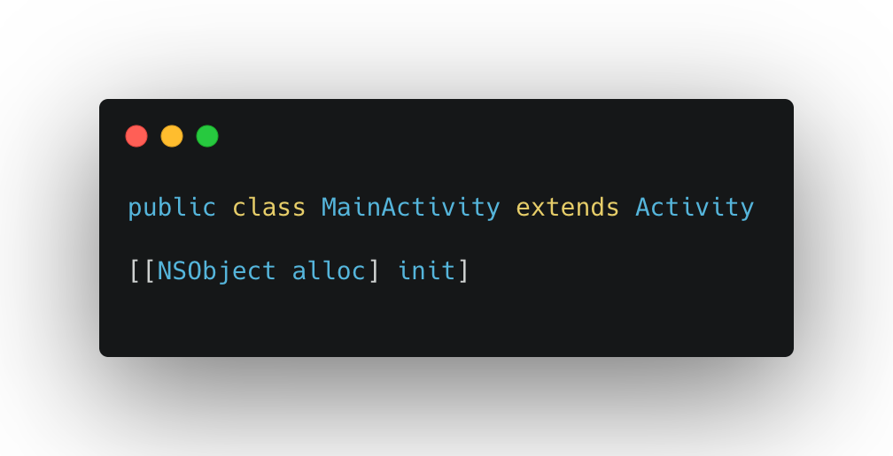
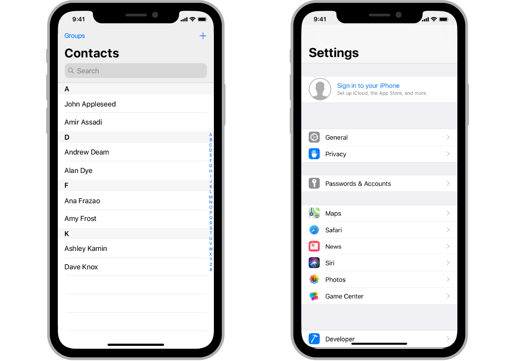
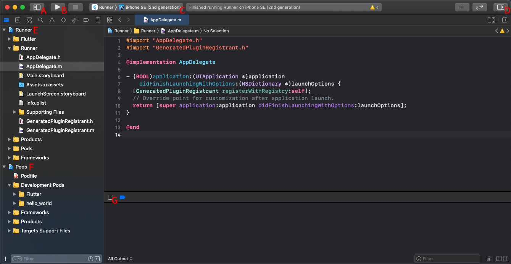
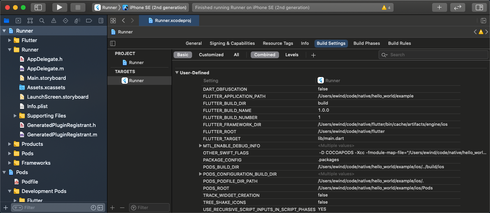
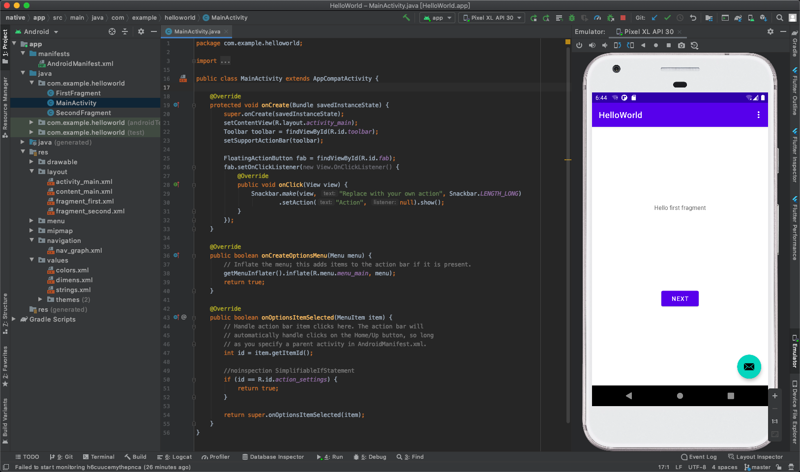
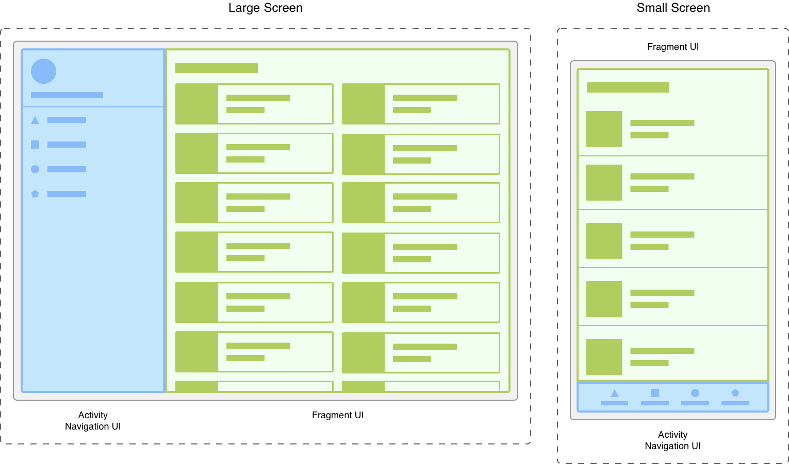
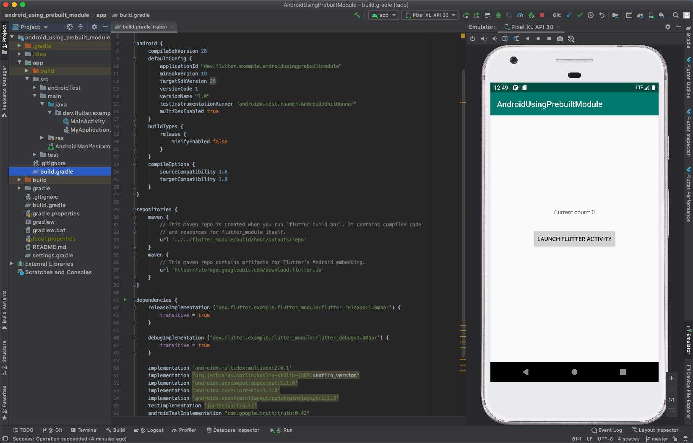

# 写给前端的原生开发基础入门



跨平台的 Hybrid 混合式开发技术栈，一直是一项非常受业界欢迎的技术。然而，许多投身其中的前端开发者往往只熟悉其中的 JS 部分，对于整个应用中基础性的原生部分了解非常有限，这是十分可惜的。

作为一名前端开发者，我在过去的一年中都在开发 Hybrid 应用框架（参见我的 [QCon Plus](https://qconplus.infoq.cn/2020/beijing/presentation/2763) 分享）。这个过程中我（不得不）学习了许多与原生应用开发相关的知识。在终于把许多点串起来之后，我发现原生应用与 Web 应用之间其实共享着相似的理念模型，二者间本质上并没有多高的壁垒和门槛。因此我整理出了这篇文章，帮助大家用前端的思维模型去理解原生应用的开发。希望读完本文，哪怕是没有相关背景的前端同学在面对一个 iOS 和安卓的典型工程时，也能知道「这大概是在干嘛」，不会受限在项目中 `*.js` 和 `*.dart` 的小世界里，更好地和原生开发同学协作。

下面我们会依次介绍这几个部分的内容：

* 前端开发与原生开发之间的异同
* 前端视角下的 iOS 开发
	* 理解 Objective-C 语法
	* Delegate 与 Protocol 概念
	* 基于 MVC 的 UI
	* 上手 Xcode
* 前端视角下的安卓开发
	* 连接 Java 与 XML
	* Activity 和 Fragment
	* 构建与依赖管理
* 原生技术栈与前端技术栈间的交互

> 注意，所谓「原生」的概念是有歧义的。在某些语境下，使用 Swift、Objective-C 和 Java 的移动端开发者会认为这些应用层开发语言才属于「原生」，而更「底层」的 C/C++ 则不属于这一范畴。本文中的「原生」泛指能直接接触到平台（操作系统）标准 API 的技术栈，不会分得这么细。另外在本文语境下，所谓「前端应用」等价于「Web 应用」。  


## 前端开发与原生开发之间的异同
很多前端同学可能对原生开发多少有种畏惧感——毕竟那可是会编译成机器码的东西啊！但其实 Web 应用与原生应用之间有两条值得一提的共性，它们可以增强你的自信心：

* **在各个平台上，GUI 的标准 API 设计都是相当共通的**。不管是 iOS 的 UIView 还是安卓的 View，它们都和 DOM 元素类似地，是一系列支持注册事件回调的 UI 对象（亦即所谓的「[保留模式 GUI](https://en.wikipedia.org/wiki/Retained_mode)」）。因此只要你熟悉 DOM 和 React/Vue 等前端 UI 框架，它们的核心概念几乎都能平滑地体现在原生应用中。不过 JSX 这样语义化嵌套表达组件的能力，属于前端社区的首创。相比之下，原生平台上朴素的 UI 构建代码往往是面条式的，较为繁冗。
* **现代 Web 应用已经和原生应用一样，是需要一套构建工具链的**。打包大型 Web 应用的过程，并不比 IDE 的构建过程更简单。因此只要你熟悉 TypeScript 这样需要 AOT 编译的语言，也能 `npm install` 配出 Webpack 全家桶环境，那么你其实已经熟悉这种「自动化管理依赖，并通过工具链来编译应用」的工作流了，心智模型的适应成本并不高。

当然，原生应用仍然是比 Web 应用更为「low-level」的，这种差异会在很多地方体现出来：

* 原生开发会涉及更丰富的 OS 能力，例如多线程、文件系统、Socket、图形上下文和各式传感器等。如果你想试试更下层的 C/C++，这也很容易通过 iOS 上的混编和安卓上的 NDK 来实现。名著《[UNIX 环境高级编程](http://www.apuebook.com/apue3e.html)》中演示的各色 POSIX 系统调用，也都尽在你的掌握之中。
* 原生开发的调试成本更高，你不能像修改 `node_modules` 源码那样直接修改你依赖的库，没有可以随手求值表达式的控制台，没有 HMR 热更新，空指针更可能直接让应用崩溃……

> 不过，Web 应用也未必就比原生应用更简单。比如作为输入 URL 就能直接访问的平台，Web 应用非常关注首屏性能，有许多加速页面载入的深度优化策略。这反而不是原生应用开发中的关注重点。  

纸上谈兵式的心灵鸡汤和预防针到此为止。相信大家现在最关心的一定是这件事——**如果我只有前端开发的背景，怎样看明白一个 iOS 或安卓应用的代码是在干嘛呢**？接下来我们就来解答这个问题。

## 前端视角下的 iOS 开发
有个可能有些令人难过的事实，那就是直到 2020 年，Objective-C 语言仍然是 iOS 开发中的一道坎。尤其对 Hybrid 应用来说，一旦涉及原生插件开发，或者接入某些第三方 SDK，那么你还是很难绕开它。比如在 React Native 中如果想用 Swift 开发 Bridge，仍然要加上 `@objc` 修饰符，并配置用于混编的头文件——所以我们不如干脆直接来搞懂 Objective-C 吧！个人经验是只要能看懂这门表面上古怪的语言，iOS 平台令人畏惧的程度一下就会低很多。

### 理解 Objective-C 语法
在我认识的（非狂热果粉）开发者群体里，大家普遍认为 Objective-C 是一门看起来十分晦涩的语言。它独特的方括号语法、排版方式和冗长的 API，都使很多人对其望而却步。但某种程度上，深受 Smalltalk 影响的它才是正统「面向对象」今日的遗孤。要理解这种风格，最重要的一点在于接受方括号的「[发消息](https://en.wikipedia.org/wiki/Message_passing)」语义。**这时一种非常实用的理解方式，是把方括号语法直接当作换皮的方法调用**。举几个最简单的例子：

``` objc
// 向 NSDate 类发送 date 消息，获得 now 实例
NSDate* now = [NSDate date];

// 向 now 实例发送 timeIntervalSince1970 消息，获得秒级时间戳
double seconds = [now timeIntervalSince1970];

// 向 now 实例发送 dateByAddingTimeInterval 消息，参数为 114514
NSDate* later = [now dateByAddingTimeInterval:114514];
```

它们改写成等价的 JS 就是这样的：

``` js
let now = NSDate.date()
let seconds = now.timeIntervalSince1970()
let later = now.dateByAddingTimeInterval(114514)
```

然后对稍微复杂一点的情况也是同理：

``` objc
// 另一种初始化方式，即先发 alloc 消息，再发 init 消息
NSDate* now = [[NSDate alloc] init];

// 初始化一个 NSCalendar 日期实例
NSCalendar* obj = [NSCalendar currentCalendar];

// 给实例发多个参数的消息
// 消息名为 ordinalityOfUnit:inUnit:forDate:
NSUInteger day = [obj ordinalityOfUnit:NSDayCalendarUnit
                                inUnit:NSMonthCalendarUnit
                               forDate:now];
```

这几行发送消息的代码，换成 JS 的方式来理解则大概是这样的：

``` js
let now = NSDate.alloc().init() // [[NSDate alloc] init]
let obj = NSCalendar.currentCalendar()

// 方法名由参数列表拼接组成
let name = "ordinalityOfUnit:inUnit:forDate:"
let day = obj[name](NSDayCalendarUnit, NSMonthCalendarUnit, now)
```

为什么不直接 `new NSDate()` 呢？因为 Objective-C 是对 C 语言的扩展，它没有选择像 C++ 那样加入 `new` 关键字，而是设计了 `[[NSDate alloc] init]` 这样的消息组合，来完成对象的构造。`alloc` 相当于 C 语言里的内存分配函数 `malloc`，而 `init` 则相当于默认的实例构造器。如果需要其他的构造器，Objective-C 里的方式是自己动手实现形如 `initWithXxx` 的方法（即所谓的 *initialiser* 初始化器）。像这样的代码：

``` objc
// initWithXxx 在 Objective-C 中非常常见
MyWidget* widget = [[MyWidget alloc] initWithStr:@"hello"
                                           width:114
                                          height:514];
```

就可以根据上面的规律，近似地这么转换：

``` js
let name = "initWithStr:width:height:" // 将消息类型理解为方法名
let initialiser = MyWidget.alloc()[name] // 先 alloc 分配空间
let widget = initialiser("hello", 114, 514) // 再 init 初始化

// 或者这样更简单的理解
let widget = new MyWidget("hello", 114, 514)
```

这里的 `MyWidget` 是一个类——作为面向对象语言，Objective-C 里是有类的。因此现代 JS 中 class 语法对应的「类和实例」经典心智模型，在这里是完全可复用的，只是语法较为非主流而已。和 C++ 类似地，Objective-C 中典型的 class 需要在 `.h` 头文件里暴露出 `@inferface` 声明，然后在 `.m` 文件里编写相应的 `@implementation` 实现。像上面的 `MyWidget` 就可以按这种方式来声明：

``` objc
// MyWidget.h

@interface MyWidget : NSObject // 继承 NSObject
@property TypeA a; // 声明一个属性，写在这里的属性对外可见
// 初始化器，instancetype 表示返回该类的实例
- (instancetype)initWithA:(TypeA)a
                        b:(TypeB)b
                        c:(TypeC)c;
// "-" 开头的是实例方法
// 需要用 [myWidget doSomething1:x] 形式调用
- (void)doSomething1:(TypeX)x;
// "+" 开头的是类方法
// 可以用 [MyWidget doSomething2:y] 形式调用
+ (void)doSomething2:(TypeY)y;
@end
```

其相应的实现则是这样的：

``` objc
// MyWidget.m

#import "MyWidget.h" // import 相当于 include

@implementation MyWidget
@property TypeB b; // 声明另一个属性，写在这里的属性是私有的
- (instancetype)initWithA:(TypeA)a
                        b:(TypeB)b
                        c:(TypeC)c {
  if(self = [super init]) {
    self.a = a;
    self.b = b;
    // ...
  }
}
- (void)doSomething1:(TypeX)x {
  // ...
}
+ (void)doSomething2:(TypeY)y {
  // ...
}
@end
```

别被上面这些代码唬住了，它们其实只相当于写了这么一点点 JS 而已：

``` js
class MyWidget extends Object {
  constructor(a, b, c) {
    super()
    this.a = a
    this.b = b
    // ...
  }
  doSomething1(x) {
    // ...
  }
  static doSomething2(y) {
    // ...
  }
}
```

只要能看明白 Objective-C 的这套表层语法，你可能会发现自己一下子就能读懂很多东西了。比如下面这段 [React Native 中用于定制原生组件的官方示例代码](https://reactnative.dev/docs/native-modules-ios)：

``` objc
// 初始化出某个支持了 React Bridge 功能的对象
// id 相当于指向任意类型对象的指针，这里加了个可选的类型提示
// RCT 是 React 的简写
id<RCTBridgeDelegate> moduleInitialiser = [[classThatImplementsRCTBridgeDelegate alloc] init];

// 用上面的对象来建立 bridge 实例
RCTBridge *bridge = [[RCTBridge alloc] initWithDelegate:moduleInitialiser launchOptions:nil];

// 用上面的 bridge 实例来建立 React Native 的 root view
RCTRootView *rootView = [[RCTRootView alloc]
                        initWithBridge:bridge
                            moduleName:kModuleName
                     initialProperties:nil];
```

是不是看起来容易理解很多了呢？

最后，如果你实在不习惯 Objective-C 的代码排版风格，这里还有个小贴士：安装 VSCode 的 [clang-format](https://marketplace.visualstudio.com/items?itemName=xaver.clang-format) 插件，在项目根目录中添加一个 `.clang-format` 文件，其内容只要一行 `BasedOnStyle: Chromium` 即可。这样就能用 VSCode 把「千奇百怪的丑」变成「整齐划一的丑」了——而且其实看久了以后，[它还是蛮有一股混元形意劲的](https://www.zhihu.com/question/24115153/answer/1597551264)。

### Delegate 与 Protocol 概念
上面的基础语法介绍，只足够让你阅读最基本的 Objective-C 代码。如果想更好地理解 iOS 原生应用的 UI 逻辑，还需要了解其中非常常见的 Delegate 与 Protocol 概念。

什么是 Delegate 呢？这是 Objective-C 中用于替代继承的设计。我们都知道，经典的继承机制虽然容易理解，但继承链带来的问题也是很明显的。比如假设框架提供了某种功能复杂而强大的 UIView 对象，那么按照 JS 中最朴素的形式，我们会通过直接继承这个类的方式来复用它：

``` js
class MyView extends UIView {
  // 在 view 加载完成时触发的生命周期钩子
  viewDidLoad() {
    // 这里的 this 上什么宝贝都能掏出来
  }
}
```

这不仅容易制造出层层包装的臃肿对象，还不易于让一个类同时扮演多种角色（涉及复杂的多继承）。相比之下，Objective-C 选择通过协议（*protocol*）机制来替代继承，其基本理念是这样的：各种框架层对象会把自己可供定制的部分（例如各种回调方法的 API）规定为一份协议，然后由我们自己实现出符合协议接口（*interface*）的对象，把这个自定义的对象作为代理「嵌入」重型的框架对象。举例来说，假如我们想自定义 WebView 的一些行为，那就不应该直接去继承 UIWebView 这个类，而是这样的：

1. 框架（UIWebView）会约定出一份名为 UIWebViewDelegate 的协议，其中包括了自己全部对外的 API，例如 `webViewDidStartLoad` 这样的生命周期钩子。这份协议中的方法既可以是必选的，也可以是可选的。
2. 框架使用者把自己需要的回调实现在一个独立的类里，并实例化它。这个对象就是作为代理的所谓 *delegate object*。这个类所实现的方法，必须能兼容 UIWebViewDelegate 这份协议。
3. 把我们的 UIWebViewDelegate 实例指派给 UIWebView 实例（即被代理的 *delegating object*），相当于对 UIWebView 的 `delegate` 属性赋值。
4. 在 UIWebView 实例运行时，它会查找并向自身的 `delegate` 成员对象发消息（执行方法调用），完成整个流程。

> 如果你还是不习惯 Delegate 这个词，也可以把它理解为 Controller。iOS 中 UIView 和 UIViewController 之间的关系，就是典型的代理关系。  

要演示这个代理机制，大概只需要这么几段 Objective-C 代码：

``` objc
// 由框架声明 UIWebView 代理协议
@protocol UIWebViewDelegate <NSObject>
@optional // 可选方法
- (void)webViewDidStartLoad:(UIWebView*)webView;
// 其他各种方法
@end

// 由使用者实现符合该协议的类
@interface MyClass <UIWebViewDelegate>
// ...
@end

// 为已有的框架对象实例设置代理
// 一般还可以通过 initWithDelegate 直接初始化框架对象
MyClass* delegate = [[MyClass alloc] init];
[webView setDelegate:delegate];
```

上面的 Objective-C 代码，大体上可以理解为这样的 JS 模式：

``` js
class MyClass implements WebViewDelegate {
  // 根据协议实现的方法
  webViewDidStartLoad() {
    // 不再存在包罗万象的 this
  }
}

// 实例化我们的轻量级 delegate 对象
let delegate = new MyClass()
myView.delegate = delegate
```

现在，我们就能更好地理解上面那段 React Native 的原生组件示例代码了：

``` objc
// 实例化出我们自定义的代理对象
id<RCTBridgeDelegate> moduleInitialiser = [[classThatImplementsRCTBridgeDelegate alloc] init];

// 用代理对象实例化出 React Native 的框架 bridge 对象
RCTBridge *bridge = [[RCTBridge alloc] initWithDelegate:moduleInitialiser launchOptions:nil];

// 用 bridge 实例化出 React Native 的 root view
RCTRootView *rootView = [[RCTRootView alloc]
                        initWithBridge:bridge
                            moduleName:kModuleName
                     initialProperties:nil];
```

对于代理机制的更多细节，可以参考 Stack Overflow 上的 [How do I create delegates in Objective-C](https://stackoverflow.com/questions/626898/how-do-i-create-delegates-in-objective-c) 讨论，以及苹果官方的 [Delegation](https://developer.apple.com/library/archive/documentation/General/Conceptual/DevPedia-CocoaCore/Delegation.html) 文档。

理解 Delegate 机制后，相信大家在阅读 Objective-C 代码时就不会存在太多障碍了，无非就是数组（NSMutableArray）和 Map（NSDictionary）之类标准数据结构的 API 冗长一点而已。当然，Objective-C 的特性不可能在这么简单的篇幅里覆盖全，它还是有很多亮点的。例如它的 ARC 内存管理机制，其实并不输于现代 C++ 的智能指针；再比如它基于 GCD 的多线程能力，也是很优秀的设计。如果你需要了解更多 Objective-C 的语言特性，推荐参考《[Objective-C Programming - The Big Nerd Ranch Guide](https://www.academia.edu/4928270/Big_Nerd_Ranch_Objective_C_Programming_Oct_2011)》一书。

### 基于 MVC 的 UI
在上一节中，我们已经提到了 UIView 这样的 UI 对象，不过仍然没有演示典型的 iOS UI 是如何建立的。这里有个好消息，那就是经典 iOS 应用的 UI 也遵循 MVC 设计模式，相信每位现在的前端同学都多少接触过它的变体（比如把 JSX 或 DOM 模板理解为 View 层，将 State 或 Store 理解为 Model 层，将 ViewModel 理解为 Controller 层）。典型的例子就是常用于实现可滚动长列表的 [UITableView](https://developer.apple.com/documentation/uikit/uitableview?language=objc)：



怎样在屏幕上绘制出这样的 UI 呢？在最简单的情况下，大体上有这么一些需要知道并控制的事：

* 整个 iOS 应用最顶层的实例，是 Xcode 为我们默认生成出的 AppDelegate 类，可以直接在这里添加一个 UITableView 类型的属性。
* 在 AppDelegate 中表示应用启动完成的生命周期钩子（`didFinishLaunchingWithOptions`，好啰嗦）里，实例化这个 UITableView 对象。这里通用的风格是先建立出一个 CGRect 类型的矩形 Frame 对象，再用这个 Frame 去初始化 View，也就是 `initWithFrame`。
* UITableView 对象需要一个 `dataSource` 数据源对象，这也是一种典型的代理形式。可以直接让 AppDelegate 实现 UITableView 需要的协议，然后把它设置为 UITableView 对象的数据源（代理）。

上面的描述对应的实际代码大致是这样的，就不翻译成 JS 了：

``` objc
// AppDelegate.h
// AppDelegate 默认支持 UIApplicationDelegate 协议
// 这里再让它多支持一个 UITableViewDataSource 协议
@interface MyAppDelegate
    : UIResponder <UIApplicationDelegate, UITableViewDataSource> {
  // 也可以用这种语法定义成员变量，这里的 table 属于 view 层
  UITableView* table;
  // 用数组存储列表数据，作为 model 层
  NSMutableArray* data = @[@"foo", @"bar", @"baz"];
}

// AppDelegate.m
// ...
// 在应用初始化完成时触发的生命周期钩子
didFinishLaunchingWithOptions:(NSDictionary*)launchOptions {
  // 没有用 Storyboard 拖控件的话，要手动初始化 UIWindow
  // 这几行和 UITableView 本身无关
  CGRect windowFrame = [[UIScreen mainScreen] bounds];
  UIWindow *theWindow = [[UIWindow alloc] initWithFrame:windowFrame];
  [self setWindow:theWindow];

  // 先建立 frame 对象，然后用它初始化 UITableView
  CGRect tableFrame = CGRectMake(0, 80, 320, 380);
  table = [[UITableView alloc] initWithFrame:tableFrame
                                       style:UITableViewStylePlain];
  [table setSeparatorStyle:UITableViewCellSeparatorStyleNone];

  // 设置 table 的数据源为 AppDelegate
  [table setDataSource:self];

  // 把 table 挂载到 window 上
  [[self window] addSubview:table];
}
// ...
// UITableViewDataSource 协议规定的方法，用于获取列表长度
- (NSInteger)tableView:(UITableView*)tableView
    numberOfRowsInSection:(NSInteger)section {
  // 返回列表数组的长度
  return [data count];
}
// UITableViewDataSource 协议规定的方法，用于获取列表项
- (UITableViewCell*)tableView:(UITableView*)tableView
        cellForRowAtIndexPath:(NSIndexPath*)indexPath {
  // 为提高性能，每次请求列表项时应先尝试复用已有的 cell 实例
  UITableViewCell* c = [table dequeueReusableCellWithIdentifier:@"Cell"];
  if (!c) {
    // 当不存在空余 cell 实例时，初始化新的 cell 实例
    c = [[UITableViewCell alloc] initWithStyle:UITableViewCellStyleDefault
                               reuseIdentifier:@"Cell"];
  }
  // 将 cell 实例的内容设置为 data 数组中相应的字符串
  // 这里的 [indexPath row] 对应 UITableView 列表的下标
  NSString* item = [data objectAtIndex:[indexPath row]];
  [[c textLabel] setText:item];

  // 返回 cell 实例供框架渲染
  return c;
}
```

可见，整个 AppDelegate 的用途相当于 Controller 层。上面的 `didFinishLaunchingWithOptions` 属于典型的 iOS 应用生命周期钩子，类似的还有 `viewDidLoad`。很明显，React 中经典的 `componentDidMount`/`componentWillMount`/`shouldComponentUpdate` 这些 API，就是借鉴 iOS 平台的命名风格而设计的。这或许是 Objective-C 对前端社区最大的影响了吧。如果你有其他 API 命名层面上的疑惑，可以参考苹果的 [Objective-C 命名风格文档](https://developer.apple.com/library/archive/documentation/Cocoa/Conceptual/CodingGuidelines/Articles/NamingMethods.html)。

注意，AppDelegate 还可以实现多种不同的协议，从而使单个类能无缝地扮演多种角色，支持与不同 UI 对象互动。个人认为这也是「组合优于继承」的体现。当然，把所有业务逻辑都放在单个对象上肯定是不好的行为，实际场景中一般会更细粒度地拆分出负责不同应用模块的对象。如果你想把上面纯粹建立静态 UITableView 的代码发展为一个 TodoMVC 性质的简单应用，参见《[Objective-C Programming - The Big Nerd Ranch Guide](https://www.academia.edu/4928270/Big_Nerd_Ranch_Objective_C_Programming_Oct_2011)》的 Chapter 27，这里不再赘述。

另外在 SwiftUI 之前，iOS 的 UI 开发使用的都是比较传统的 OO 风格，不支持 JSX 那样直接声明式地编写出组件的层级结构。这样在建立多个具备复杂嵌套结构的 View 时，很容易出现一大堆类似于手动生成 DOM 对象的面条代码。为此，Xcode 提供了 [Interface Builder](https://developer.apple.com/xcode/interface-builder/) 这样拖控件建立 UI 的工具。它可以生成 XIB 格式的布局文件，简化手动编码的工作量，也支持用 [Auto Layout](https://developer.apple.com/library/archive/documentation/UserExperience/Conceptual/AutolayoutPG/index.html) 来便捷地配置 UI 样式。而在管理多个 ViewController 之间的切换（类似页面路由跳转）时，Xcode 也提供了 [Storyboard](https://developer.apple.com/library/archive/documentation/ToolsLanguages/Conceptual/Xcode_Overview/DesigningwithStoryboards.html) 这样的可视化工具。不过由于在开发 Hybrid 框架时往往并不需要拖控件，因此个人并不熟悉上面这些工具，感兴趣的同学可以自己搜索 iOS 开发教程学习。尤其是在设计一些时下流行的「拖拽组件生成页面」的前端 Low Code 平台时，Xcode 的经典设计或许也能对大家有所启发。

### 上手 Xcode
上面的介绍主要属于纯粹的代码层面。但对于 iOS 这样自成体系的开发，几乎没有人会使用纯粹的文本编辑器来编码，而是使用 Xcode 这个 IDE。接下来我们会简单介绍一些 Xcode 的基础操作。

我们以 Flutter 插件来作为例子。在 Flutter 中，插件（[Plugin](https://flutter.dev/docs/development/packages-and-plugins/developing-packages#plugin)）可以用来把平台特定的能力包装给 Dart 侧使用。每个 Flutter 插件项目中，都既会包含「作为库被使用的」可复用 Dart 代码，也会包含调用这些库 API 的示例 Dart 代码。同样地，**在创建插件时，Flutter 默认既会创建出供复用的 iOS 平台代码，也会创建出调用这些代码的示例 iOS 项目**。这个过程只需要一行命令就足够了：

``` sh
$ flutter create --template=plugin --platforms=android,ios -i objc hello_world
```

我们这里关心的是插件的 iOS 部分。因此接下来不要去直接 `flutter run`，而是手动这么干：

``` sh
$ cd hello_world/example/ios
$ pod install # 需要先安装好包管理器 CocoaPods
```

现在打开 `hello_world/example/ios` 目录下的 `Runner.xcworkspace` 文件（注意不是 `hello_world/ios`，也不是 `Runner.xcodeproj`），就可以看到 iOS 视角下的 Flutter 工程了。如图所示：



这里我们打开的是名为 Runner 的 Xcode *Workspace*。Runner 是由 Flutter 生成的名字，可以理解成这是用来运行 Flutter 环境的一层壳。Xcode 中的每个 Workspace 可以包括多个 *Project*，在这个例子中就是左侧蓝色的 Runner Project（即插件的示例应用）和 Pods Project（即作为 CocoaPods 依赖被安装进来的插件工程，还有 Flutter 框架）。上图中字母标记出的位置，则对应一些最主要的 IDE 功能：

* **A** - 开闭左侧的 Navigator。它下面的这排 Navigator 小图标对应一些非常常用的功能，如文件目录、类层级结构、查找替换、编译警告、性能占用、断点、构建日志等。它们可以用 `cmd` + 数字切换。
* **B** - 编译运行 App，快捷键 `cmd` + `R`。
* **C** - 切换部署设备，如真机和模拟器。
* **D** - 开闭右侧的 Inspector。这个部分主要用于拖控件时的配置，在做纯编码工作时可以关掉。
* **E** - 点这里选中 Runner Project，即可查看插件示例工程的整体配置。这下面的 AppDelegate 等标准 iOS 代码都只是一层壳，毕竟重点都是在 `.dart` 里。
* **F** - 点这里选中 Pods 这个 Project，即可查看插件本身的整体配置（插件和插件示例是两个独立的工程，后者依赖前者）。展开这下面 Development Pods 中的 `hello_world` 子目录，可以查看插件实际的 iOS 平台源码。
* **G** - 开闭底部输出日志的 Debug Area，快捷键 `cmd` + `shift` + `Y`。

上面这些功能主要是用于具体编码的，还有一个重要的部分是进行项目整体的配置。点击上面的 E 或 F 即可进入：



这里可以看到 **PROJECT** 和 **TARGETS** 两个不同的标签。每个 Xcode 的 Project 能编译到多种 [Target](https://developer.apple.com/library/archive/documentation/ToolsLanguages/Conceptual/Xcode_Overview/WorkingwithTargets.html)。对标准的 iOS App 来说，默认 Target 就是整个应用的 Bundle。在这个界面下，可以配置各种编译选项，比如库和框架的搜索路径、自定义宏参数、环境变量等。iOS 工程中 `.h` 和 `.m` 源码的编译方式，基本与经典的 C/C++ 项目一致。可以把这里当作一个可视化的 Webpack 配置界面，有需要时在这里修改具体的配置。

在这个项目里，还可以用 [CocoaPods](https://cocoapods.org/) 安装第三方依赖。CocoaPods 和 NPM 的用法很像，安装后的依赖会出现在 Pods Project 下。最后还有个地方值得一提，那就是 Xcode 中的目录结构是虚拟的，如果打开 Finder 发现文件路径对不上的话不要觉得奇怪，以 IDE 中最终展示的为准即可。

目前介绍的这些内容，应该足够帮助大家更好地理解 React Native 和 Flutter 插件的 iOS 部分了。限于篇幅，本文中的 iOS 部分也就到此为止。总体来看，虽然 Objective-C 和 Xcode 对前端同学们可能较为陌生，但它们反映了苹果在 UI 开发范式上多年来的积累和探索，是值得尊重的。另外 iOS 对于混编 C++ 的支持很不错，如果你希望在移动端尝试一些经典的 C++ 库，它也是比较方便的选择。

## 前端视角下的安卓开发
和 iOS 部分相比，本文对安卓的介绍会相对少很多——Java 与 TypeScript（至少在表层语法上）看起来很接近，其基于继承的 OO 机制也和 ES2015 后的 JavaScript 基本一致。因此这里无需花费精力像 Objective-C 那样去从头介绍基本的语言语法和 OO 机制，节约了很多篇幅。

### 连接 Java 与 XML
安卓大量应用了 XML 来管理可视化拖拽控件生成的 UI，以及很多静态配置和资源。但和 iOS 中重度依赖 Interface Builder 的 XIB 不同，安卓的 XML 是更为语义化的，对手工编辑更为友好（iOS 在 XIB 之前甚至还使用的是二进制的 NIB，它对 Git 工作流来说简直是灾难）。下面我们给出一段安卓应用中典型的 XML：

``` xml
<manifest xmlns:android="http://schemas.android.com/apk/res/android"
    xmlns:tools="http://schemas.android.com/tools"
    package="com.example.helloworld">
    <application
        android:allowBackup="true"
        android:icon="@mipmap/ic_launcher"
        android:label="@string/app_name"
        android:roundIcon="@mipmap/ic_launcher_round"
        android:supportsRtl="true"
        android:theme="@style/Theme.HelloWorld">
        <activity
            android:name=".MainActivity"
            android:label="@string/app_name"
            android:theme="@style/Theme.HelloWorld.NoActionBar">
            <intent-filter>
                <action android:name="android.intent.action.MAIN" />
                <category android:name="android.intent.category.LAUNCHER" />
            </intent-filter>
        </activity>
    </application>
</manifest>
```

先不管这段 XML 的实际用途，你觉得它和前端常见的 HTML 在语法上有什么不同呢？概括说来大致有这么几点：

* XML 需要必选的 `xmlns` 命名空间（namespace）属性。这在 HTML5 里是可选（即支持但没多少人用）的。这里形如 `xmlns:android="http://schemas.android.com/apk/res/android"` 的属性，就表示这份 XML 内部的`android` 属性所对应的 URI（即唯一的资源标识符，但不是有效的 URL 地址）。用这种方式，还可以把我们自己定义出的 TextView 和安卓默认的 TextView 区分开。
* 属性值可以用 `".MainActivity"` 的语法来指向 Java 中的 class，这里指向的就是后面会提到的 MainActivity。
* 属性值可以用 `"@string/app_name"` 的语法来互相链接，像这里这个 `app_name` 的值就会指向另一份 XML 文件中的 `<string name="app_name">HelloWorld</string>` 标签，从而获得其中的 `HelloWorld` 常量。

上面的 XML 就是所谓的 [Manifest](https://developer.android.com/guide/topics/manifest/manifest-intro)，这是安卓应用顶层的配置。除此之外，安卓中标准的 UI 元素也使用 XML 形式来定义，例如 TextView 和 Button 就是下面这样的，初看起来很像 React：

``` xml
<TextView
    android:id="@+id/textview_first"
    android:layout_width="wrap_content"
    android:layout_height="wrap_content"
    android:text="@string/hello_first_fragment"
    app:layout_constraintBottom_toTopOf="@id/button_first"
    app:layout_constraintEnd_toEndOf="parent"
    app:layout_constraintStart_toStartOf="parent"
    app:layout_constraintTop_toTopOf="parent" />
<Button
    android:id="@+id/button_first"
    android:layout_width="wrap_content"
    android:layout_height="wrap_content"
    android:text="@string/next"
    app:layout_constraintBottom_toBottomOf="parent"
    app:layout_constraintEnd_toEndOf="parent"
    app:layout_constraintStart_toStartOf="parent"
    app:layout_constraintTop_toBottomOf="@id/textview_first" />
```

和交由框架读取的 Manifest 不同，这些表示 UI 的 XML 需要在业务代码中被用到。这时要怎么在 Java 中找到对应的 XML 节点呢？和朴素的 DOM 非常类似地，这是通过 XML 中的 `id` 属性来实现的。像上面 XML 中形如 `android:id="@+id/textview_first"` 这样的字段，就定义了 `textview_first` 这个 ID。这里加号表示这是我们新增的 ID，而非平台已有的。Button 元素可以通过 ID 来语义化地与 TextView 元素互相引用，这对表达布局约束很有帮助。并且这些 XML 元素也易于在 Java 代码中访问到：

``` java
// 某个类中约定的返回自定义 view 的方法
@Override
public View onCreateView(
        LayoutInflater inflater, ViewGroup container,
        Bundle savedInstanceState
) {
    // 用 id 从 XML 中 inflate 出自定义的 view
    return inflater.inflate(R.layout.my_fragment, container, false);
}
```

在上面的代码中，静态的 XML 元素被反序列化（即 [inflate](https://stackoverflow.com/questions/4576330/what-does-it-mean-to-inflate-a-view-from-an-xml-file)）成了运行时的 View 对象。而传入 `inflate` 方法的 [R](https://stackoverflow.com/questions/4953077/what-is-the-class-r-in-android) 对象，则是包含了应用中全部资源定义的对象实例。如果你的安卓应用包名是 `com.example.hello`，那么应用中所有的资源就会被自动生成到 `com.example.hello.R` 这个类下面。顺带多说一句，Android Studio 在打开 XML 文件时默认会展示可视化的 Design 视图，想看 XML 结构的话切换成 Code 视图就可以了。

### Activity 和 Fragment
只要能明白安卓上 Java 和 XML 之间这种常见的绑定关系，就可以开始了解安卓平台上的 UI 抽象，进而理解典型安卓应用的结构了。

这里的例子是个由 Android Studio 生成的默认应用，它可以点击紫色按钮切换白色区域内的文字：



对于这个「点击按钮切换页面」的简单安卓应用，有这么几个最基本的概念值得了解：

* [Activity](https://developer.android.com/reference/android/app/Activity) 相当于一个具备完整功能的页面，类似于 iOS 的 ViewController。就像我们在 React 项目中把应用功能拆分为页面路由组件那样，安卓项目需要在 `AndroidManifest.xml` 里通过 `<activity>` 标签，静态地声明自己有多少个 Activity。每个 Activity 都有自己的 XML 布局（*layout*），它们位于 `res/layout` 目录下。
* [Fragment](https://developer.android.com/guide/fragments) 相当于页面中拆分出的一块 UI，类似于 React 和 Vue 中的组件。可以认为 Activity 中的内容是由 Fragment 组装起来的。Fragment 也具备自己的 XML 布局，同样位于 `res/layout`。
* 一般应用中还很常见 [Intent](https://developer.android.com/reference/android/content/Intent) 的概念。它的主要用途之一是作为 Activity 之间通信的数据结构，实现 Activity 页面之间的路由跳转。安卓上的返回键默认就是返回上一个 Activity 的。在 `AndroidManifest.xml` 文件中，`<activity>` 元素内就有静态写好的 `<intent-filter>` 元素，其中指定了 Activity 要监听名为 `MAIN` 的事件。 不过这个例子简单到没有涉及多个 Activity 之间的切换，因此这里就不详细展开了。



如这张 [Android Developers](https://developer.android.com/guide/fragments) 文档中的附图所示，你也可以直接在 Activity 中构建 UI（管理各种 View 对象）。但推荐的做法是用 Activity 管理那些应用中长期存在的静态性、全局性 UI，用 Fragment 管理那些较为动态的部分。 

以刚才的「按钮点击切换 UI」这个需求为例，下面做一个简要的介绍，把值得关注的部分代码串起来。首先自然是作为应用入口的 MainActivity 了：

``` java
// 这个名字略繁冗的 AppCompactActivity 是用来保障前向兼容性的
public class MainActivity extends AppCompatActivity {
    // 应用初始化时的生命周期钩子
    @Override
    protected void onCreate(Bundle savedInstanceState) {
        super.onCreate(savedInstanceState);
        // 把 layout/activity_main.xml 加载为布局
        // 这里会自动 inflate，无需使用 inflater
        setContentView(R.layout.activity_main);
        // ...
    }
    // ...
}
```

这段代码实例化了 `activity_main.xml`，这份 XML 中有 Toolbar（工具栏）、FloatingActionButton（底部按钮）等表示静态 UI 的 XML 元素，这些都很容易理解。而页面中支持动态切换的部分，则是用一行 `<include layout="@layout/content_main" />` 所引入的另一份 XML，其内容就是我们要为其编写业务逻辑的 Fragment：

``` xml
<!-- content_main.xml -->

<fragment
    android:id="@+id/nav_host_fragment"
    android:name="androidx.navigation.fragment.NavHostFragment"
    android:layout_width="0dp"
    android:layout_height="0dp"
    app:defaultNavHost="true"
    app:layout_constraintBottom_toBottomOf="parent"
    app:layout_constraintLeft_toLeftOf="parent"
    app:layout_constraintRight_toRightOf="parent"
    app:layout_constraintTop_toTopOf="parent"
    app:navGraph="@navigation/nav_graph" />
```

这个 Fragment 有些像路由组件的容器，它的 `app:navGraph` 属性指向了一份保存路由的 XML，其中进一步通过 ID 指向了我们想来回切换的两个 Fragment：

``` xml
<!-- nav_graph.xml -->

<navigation xmlns:android="http://schemas.android.com/apk/res/android"
    xmlns:app="http://schemas.android.com/apk/res-auto"
    xmlns:tools="http://schemas.android.com/tools"
    android:id="@+id/nav_graph"
    app:startDestination="@id/FirstFragment">

    <!-- 第一个 fragment -->
    <fragment
        android:id="@+id/FirstFragment"
        android:name="com.example.helloworld.FirstFragment"
        android:label="@string/first_fragment_label"
        tools:layout="@layout/fragment_first">
        <!-- 显式声明它的路由目标是第二个 fragment -->
        <action
            android:id="@+id/action_FirstFragment_to_SecondFragment"
            app:destination="@id/SecondFragment" />
    </fragment>

    <!-- 第二个 fragment -->
    <fragment
        android:id="@+id/SecondFragment"
        android:name="com.example.helloworld.SecondFragment"
        android:label="@string/second_fragment_label"
        tools:layout="@layout/fragment_second">
        <!-- 显式声明它的路由目标是第一个 fragment -->
        <action
            android:id="@+id/action_SecondFragment_to_FirstFragment"
            app:destination="@id/FirstFragment" />
    </fragment>
</navigation>
```

上面这两个 Fragment 的 `tools:layout` 属性则可以进一步跳转，分别指向两份用来放置实际 UI 的 XML。这里每份表达布局的 XML 里都放着一个 TextView 和一个 Button，像这样：

``` xml
<!-- fragment_first.xml -->

<androidx.constraintlayout.widget.ConstraintLayout xmlns:android="http://schemas.android.com/apk/res/android"
    xmlns:app="http://schemas.android.com/apk/res-auto"
    xmlns:tools="http://schemas.android.com/tools"
    android:layout_width="match_parent"
    android:layout_height="match_parent"
    tools:context=".FirstFragment">

    <TextView
        android:id="@+id/textview_first"
        android:layout_width="wrap_content"
        android:layout_height="wrap_content"
        android:text="@string/hello_first_fragment"
        app:layout_constraintBottom_toTopOf="@id/button_first"
        app:layout_constraintEnd_toEndOf="parent"
        app:layout_constraintStart_toStartOf="parent"
        app:layout_constraintTop_toTopOf="parent" />

    <Button
        android:id="@+id/button_first"
        android:layout_width="wrap_content"
        android:layout_height="wrap_content"
        android:text="@string/next"
        app:layout_constraintBottom_toBottomOf="parent"
        app:layout_constraintEnd_toEndOf="parent"
        app:layout_constraintStart_toStartOf="parent"
        app:layout_constraintTop_toBottomOf="@id/textview_first" />
</androidx.constraintlayout.widget.ConstraintLayout>
```

到这里，我们就已经看到了 UI 是如何被拆分为 XML 的了。那么该如何执行 Fragment 切换的逻辑呢？这只需要再加一点 Java 代码就可以了：

``` java
public class FirstFragment extends Fragment {

    @Override
    public View onCreateView(
            LayoutInflater inflater, ViewGroup container,
            Bundle savedInstanceState
    ) {
        // 从 layout/fragment_first.xml 中 inflate 出 view
        return inflater.inflate(R.layout.fragment_first, container, false);
    }

    public void onViewCreated(@NonNull View view, Bundle savedInstanceState) {
        super.onViewCreated(view, savedInstanceState);

        // 为 id 为 button_first 的元素注册点击事件回调
        view.findViewById(R.id.button_first).setOnClickListener(new View.OnClickListener() {
            // 传统的 Java 不支持函数一等公民，需要把回调函数作为实例方法来传递
            @Override
            public void onClick(View view) {
                // 查找匹配这个 Fragment 的路由项，执行相应的跳转 action
                NavHostFragment.findNavController(FirstFragment.this)
                        .navigate(R.id.action_FirstFragment_to_SecondFragment);
            }
        });
    }
}
```

这样我们就走通了整个动态切换 Fragment 的流程，可见这里很大的一部分工作都是在处理 XML。不过这里的 XML 并不支持 `{{foo}}` 这样的表达式，不能把它和 JSX 或 Vue 的模板简单地等同起来。

### 构建与依赖管理
最后对于 Android Studio 这个 IDE，个人觉得它除了在初始化时需要处理一些网络问题来下载安卓 SDK 和 AVD 虚拟机等之外，并没有什么需要特殊关照的地方，常用功能几乎都在 IDE 界面周围的那一圈写了出来，大家直接生成一个模板项目点进去玩就行了。这里放一些最基础的快捷键：

* `cmd` + `1` 开闭左侧项目窗口
* `cmd` + `3` 开闭底部查找窗口
* `cmd` + `5` 开闭底部调试窗口
* `cmd` + `6` 开闭底部日志窗口
* `ctrl` + `R` 简单重新执行应用
* `ctrl` + `D` 带调试器执行应用

基于 Android Studio，可以比较容易地演示 Hybrid 技术栈是如何接入原生平台的。和 Xcode 做了一个令人困扰的黑盒子 GUI 来配置编译参数不同，安卓项目的构建使用的是 Gradle 这个脚本化的 DSL（详见 [Configure Your Build](https://developer.android.com/studio/build)）。这里的例子是个嵌入了 Flutter 的安卓应用：



在上图中点击 **LAUNCH FLUTTER ACTIVITY**，就会切换到 Flutter 的界面。这是如何做到的呢？

一个安卓项目（Project）可以由多个 [Module](https://developer.android.com/studio/projects#ApplicationModules) 组成。Module 既可以是标准的应用（app module），也可以是跨项目复用的库（library module）。这里的库又分为纯粹的 Java Library 和安卓专用的 Android Library 两类，后者可以包含各种静态资源和 Manifest 配置（支持复用 Manifest，就相当于支持直接复用一系列开箱即用的 Activity），并打包为 [AAR](https://developer.android.com/studio/projects/android-library) 格式。Flutter 就可以通过 Android Library 的形式，嵌入到已有的安卓应用之中。换句话说，这个安卓应用依赖了一个 Flutter Module。

这个 Flutter Module 是怎么生成的呢？把 Flutter 项目编译为 AAR 格式即可：

``` sh
$ cd my_flutter_module_project
$ flutter build aar
```

我们这样编译出的 Flutter AAR 库，可以按照与安卓工作流匹配的方式来复用。在安卓中，引入第三方依赖的方式和配置 `package.json` 也很接近，像这样：

``` groovy
// app/build.gradle

// 指定安卓应用编译 SDK 的默认配置，与 Flutter 无关
android {
    compileSdkVersion 28
    defaultConfig {
        applicationId "dev.flutter.example.androidusingprebuiltmodule"
        minSdkVersion 19
        targetSdkVersion 28
        versionCode 1
        versionName "1.0"
        testInstrumentationRunner "androidx.test.runner.AndroidJUnitRunner"
        multiDexEnabled true
    }
    buildTypes {
        release {
            minifyEnabled false
        }
    }
    compileOptions {
        sourceCompatibility 1.8
        targetCompatibility 1.8
    }
}

// 依赖仓库配置
repositories {
    maven {
        // 运行 `flutter build aar` 后生成的本地依赖
        // 其中包含被接入的 Flutter 项目编译后的产物
        url '../../flutter_module/build/host/outputs/repo'
    }
    maven {
        // 包含 Flutter 在安卓端依赖的运行时
        url 'https://storage.googleapis.com/download.flutter.io'
    }
}

// 指定具体的依赖项
dependencies {
    // 被编译到 AAR 格式的发布模式 Flutter 项目
    releaseImplementation ('dev.flutter.example.flutter_module:flutter_release:1.0@aar') {
        transitive = true
    }

    // 被编译到 AAR 格式的调试模式 Flutter 项目
    debugImplementation ('dev.flutter.example.flutter_module:flutter_debug:1.0@aar') {
        transitive = true
    }

    // 一些其他的标准安卓项目依赖
    implementation 'androidx.multidex:multidex:2.0.1'
    implementation "org.jetbrains.kotlin:kotlin-stdlib-jdk7:$kotlin_version"
    implementation 'androidx.appcompat:appcompat:1.1.0'
    implementation 'androidx.core:core-ktx:1.1.0'
    implementation 'androidx.constraintlayout:constraintlayout:1.1.3'
    // ...
}
```

配置好依赖后，只要在安卓项目的按钮点击回调中发送 Intent，就可以启动 Flutter 的 Activity 了。Flutter 还能以 Fragment 的形式更灵活地接入安卓项目。具体详见 [Add Flutter to Existing App](https://flutter.dev/docs/development/add-to-app) 系列文档，以及官方的 [Add-to-App Samples](https://github.com/flutter/samples/tree/master/add_to_app)。另外这里配置的只是 Java 依赖，如果想在安卓平台上尝试 JS 引擎等 C++ 项目，还需要配置 [NDK](https://developer.android.com/ndk/guides) 并熟悉 [JNI](https://developer.android.com/ndk/samples/sample_hellojni) 这套 Java 与 C++ 之间的桥接 API。

以上非常简略地介绍了「前端同学可能较为感兴趣的」安卓平台开发相关内容。作为总结，个人觉得安卓是个相对更为接近 Web 工作流和习惯的平台，需要特别强调的特殊设计相对较少，更易于前端同学对移动端开发做一些学习性的入门尝试。

## 原生技术栈与前端技术栈间的交互
最后，这里概述性地科普一下前端技术栈（包括 JavaScript 和更广义上的 Dart）与原生技术栈之间的交互。

我们常常使用 Bridge（也可以理解成 [FFI](https://en.wikipedia.org/wiki/Foreign_function_interface)）来统称那些连接不同语言环境的接口。对 Hybrid 应用来说，有很多大家耳熟能详的 Bridge，如 [iOS WebView 的 JS Bridge](https://github.com/marcuswestin/WebViewJavascriptBridge)、[React Native 的 JS Bridge](https://reactnative.dev/docs/native-modules-ios)、[Node.js 的 N-API](https://nodejs.org/dist/latest/docs/api/n-api.html)，以及 [Flutter 的 Platform Channel](https://flutter.dev/docs/development/platform-integration/platform-channels) 等等。在个人理解中，它们大体上可以分为两种，即异步的 Bridge 和同步的 Bridge。

所谓异步和同步，主要指的是 Bridge 在 Hybrid 业务逻辑一侧的使用方式，像这样：

``` js
const a = await someNativeMethod() // 异步 Bridge
const b = someNativeMethod() // 同步 Bridge
```

这种差异初看起来只是 API 设计层面的一点区别，但背后的实现原理却可能有非常大的不同。虽然「异步」听起来似乎更为复杂，但这类 Bridge 的实现成本一般更低，也一般是常见 Hybrid 方案默认会提供的。它们的常见特点是这样的：

* 使用 JSON 这类可序列化的数据格式，通过深拷贝数据的形式通信。
* 消息的发送方和接收方可以位于不同的线程，可能存在毫秒级的延迟。
* 通信双方的运行时环境是隔离的。

如果只是想在某个原生按钮被按下时通知 JS，这种 Bridge 是很合适的。但如果你希望在每帧高频地在 JS 环境操作一些原生对象，那么需要考虑同步的 Bridge。

同步的 Bridge 一般会更接近语言引擎暴露出的标准 API，例如 N-API 和 
[Dart FFI](https://dart.dev/guides/libraries/c-interop)。它常常用来为语言实现出各平台上的标准库。比如 JS 的 ECMAScript 规范中就没有 DOM 的概念，像 `document.getElementById` 这样的 API，就可以认为是通过同步的 Bridge 来定义的。这方面做得最好的是 Node.js 的 N-API。简单说来，如果想用 C++ 给 JS 运行时扩展出一个朴素的原生 Print 方法，只要几行就可以实现出其本体了：

``` cpp
#include <napi.h>
#include <string>
#include <cstdio>

// 原生函数均接受 JS 的调用者对象，返回某种 JS 中的 Value
Napi::Value Print(const Napi::CallbackInfo& info) {
  // 把 JS 传入的第一个参数导出到 std::string
  auto x = info[0].As<Napi::String>().Utf8Value();
  printf("%s\n", x.c_str()); // 向谭浩强老师致敬
  return info.Env().Undefined(); // 返回 undefined
}
```

然后只要几行胶水，就能把这个 `Print` 函数包装成 Node.js 中的 C++ 原生模块：

``` cpp
Napi::Object InitAll(Napi::Env env, Napi::Object exports) {
  exports.Set("Print", Napi::Function::New(env, Print));
  // 其他原生方法也类似，照猫画虎即可
  exports.Set("Hello", Napi::Function::New(env, Hello));
  exports.Set("World", Napi::Function::New(env, World));
  return exports;
}

// 要导出整个模块，在整个 C++ 文件最后加一行即可
NODE_API_MODULE(NODE_GYP_MODULE_NAME, InitAll)
```

最后只要编译出这个有效代码不过十来行的 C++ 文件就行：

``` js
const { Print } = require('./build/Release/demo.node');
Print('hello world');
```

这种 Bridge 最大的优势是不需要异步通信的开销，和原生环境有很好的兼容性：

``` cpp
// info[0] 是 JS 中传来的第一个函数参数
// 可以把任意的原生资源对象直接挂到这个 JS 对象上
Napi::External a = info[0].As<Napi::External<MyResource>>();
```

这种场景下，JS 的 GC 可以用来管理原生对象的生命周期，比如在 JS 对象垃圾回收时自动释放掉绑定在它上面的 C++ 对象，是很方便的。不过要注意，各种带 GC 语言的对象生命周期，一般都是引擎自行管理的。像在 JS 和 Java 这样两门带 GC 的语言之间，就很难做到这样的效果，还是需要回退到异步深拷贝数据的 Bridge 形式。

另外在这方面，Dart VM 的 FFI 做得比 Node 更进一步，可以在 Dart 侧直接打开动态库，执行里面的函数（符号）。比如对于一个 C 语言的 Hello World 函数：

``` c
void hello_world() {
    printf("Hello World\n");
}
```

它在被编译成动态库（macOS 上的 `.dylib`，或者 Windows 上的 `.dll`）后，就可以在 Dart 里直接这么调用：

``` dart
// 在 Dart 侧建立 C 函数的签名
typedef hello_world_func = ffi.Void Function();

// C 函数会被包装成 Dart 函数，为这个 Dart 函数类型定义一个别名
typedef HelloWorld = void Function();

// 打开动态库
final dylib = ffi.DynamicLibrary.open('hello_world.dylib');

// 从动态库中查找名为 'hello_world' 的 C 函数
// hello_world_func 对应 C 的函数签名
// 返回的 Dart 原生函数类型为 HelloWorld
final HelloWorld hello = dylib
  .lookup<ffi.NativeFunction<hello_world_func>>('hello_world')
  .asFunction();

// 调用这个直通 C 的 Dart 函数
hello();
```

Dart FFI 提供的这种能力在 JS 社区也有实现，参见 [node-ffi-napi](https://github.com/node-ffi-napi/node-ffi-napi)。

简单总结：异步 Bridge 存在通信的性能瓶颈，而同步 Bridge 虽然强大，但开发接入的成本相对较高。如果你在开发 Hybrid 应用，那么请注意挑选适合自己应用场景的 Bridge 方案。当然如果你只是单纯对跨语言技术栈感兴趣但缺乏相关经验，那么不妨利用 Node.js 的 [node-addon-api](https://github.com/nodejs/node-addon-api) 和 [QuickJS](https://github.com/bellard/quickjs) 进行一些尝试。它们都能轻松地让 JavaScript 接触到非常 low-level 的能力，扩展前端技术栈的边界范围。


## 总结
本文以 iOS 和安卓平台为例，介绍了前端背景的同学在工作中接触到原生开发时，可能遇到的主要概念性问题。但其实不管在哪个平台，GUI 背后的原理都是非常共通的。因此相比拘泥于（甚至神化）某种库、框架、语言、平台与编程范式，这里更建议大家多尝试看看「外面的世界」，多关注一些通用的基础性工程知识，例如该如何调试、构建、渲染等。在把更多基础知识融会贯通地串在一起后，相信大家一定能看到更广阔的风景——我还是非常看好 Web-like 跨平台技术栈的未来，但这个未来需要我们自己去创造。

本文不允许未授权转载。更多原创技术内容，欢迎关注我的 [GitHub](https://github.com/doodlewind) 和 [Twitter](https://twitter.com/ewind1994)。
